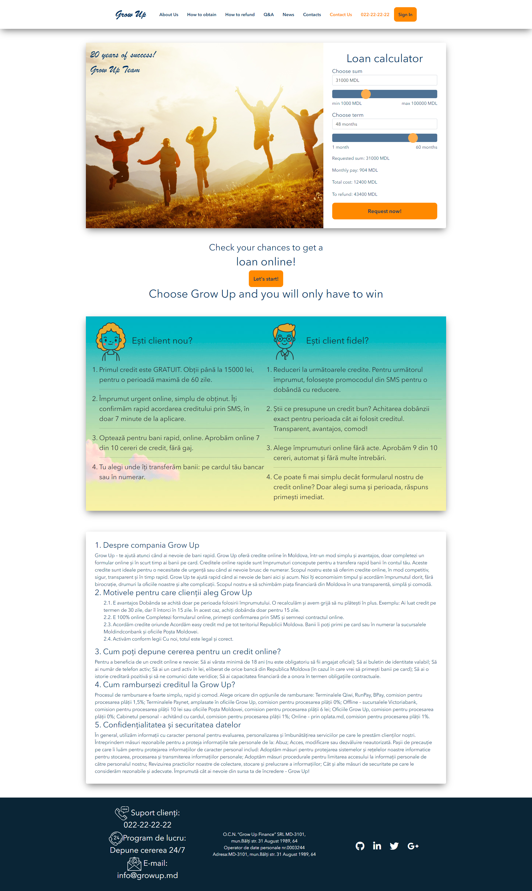
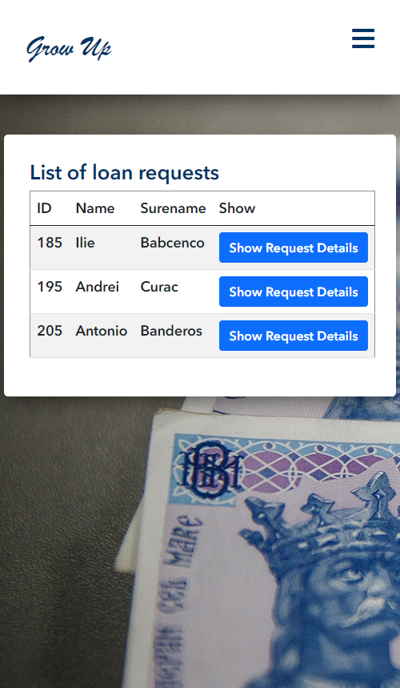

# Grow Up

## Description

This web application is destined for microfinance organizations, meaning to manage loans and news from a web page. 

I implemented next features in this project: 
1. Full navigation part which contains next pages: About company, how to obtain a loan, how to refund, q&a, news, contacts sections;
2. A user can request a loan online using a form;
3. Managers can manage news and loans from cms part (with session feature), they have to login;
4. All CRUD operations are available for news and loans;
5. Users can do the calculations on main page for displaying loans info.

## Built With

- Java
- Java Servlets
- Java JSP
- MySQL
- Tomcat
- Maven
- Bootstrap

## Set up this projecect locally

- Install the following:

1. Java 1.8
2. MySQL
3. NetBeans 8.2 or IntelijIdea Ultimate Edition
4. Tomcat
5. Maven

## How it looks

| View on desktop      | View on mobile version       |
| ---------------------------- | ---------------------------- |
|  |  |
|  |  |
|  |  |

### Deployment

[Check the live version from Heroku](http://grow-up-project.herokuapp.com/)
`P.S. If you wanna check cms part use administrator1 as username and also as password.`

## Authors

👤 **Ilie Babcenco**

  

## 🤝 Contributing

Contributions, issues, and feature requests are welcome!

If you want to contribute, you can clone this project or fork it.

If you found an issue, feel free to check the [issues page](https://github.com/iliebabcenco/grow-up/issues).

## Show your support

Give a ⭐️ if you like this project!

## Acknowledgments

- [Microverse](https://www.microverse.org/)
